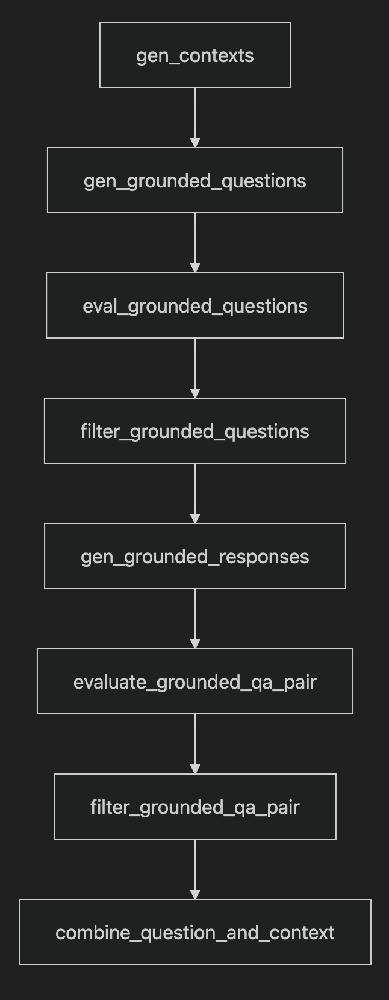

# InstructLab Skills Synthetic Data Generation


The provided notebooks demonstrate how to customize language models by generating training data for specific skills, following the methodology outlined in the LAB (Large-scale Alignment for Chatbots) framework [[paper link](https://arxiv.org/pdf/2403.01081)].

### Customizing Model Behavior

The LAB framework enables us to shape how a model responds to various tasks by training it on carefully crafted examples. Want your model to write emails in your company's tone? Need it to follow specific formatting guidelines? This customization is achieved through what the paper defines as compositional skills.

Compositional skills are tasks that combine different abilities to handle complex queries. For example, if you want your model to write company emails about quarterly performance, it needs to:
- Understand financial concepts
- Perform basic arithmetic
- Write in your preferred communication style
- Follow your organization's email format

### Demo Overview

The example notebooks will show you how to:
1. Set up a teacher model for generating training data
2. Create examples that reflect your preferred style and approach
3. Generate Synthetic Data
4. Validate that the generated data matches your requirements

The end goal is to create training data that will help align the model with your specific needs, whether that's matching your company's communication style, following particular protocols, or handling specialized tasks in your preferred way.

### Instructlab Grounded Skills Generation Pipeline 
InstructLab uses a multi-step process of generation and evaluation to generate synthetic data. For grounded skills it looks like this: 

<table>
<tr>
  <td>
    
  </td>
  <td>
    <ul>
      <li>
        <strong>Context Generation (<code>gen_contexts</code>)</strong><br>
        Generates diverse, relevant contexts for the skill<br>
        Produces 10 unique contexts per run<br><br>
      </li>
      <li>
        <strong>Question Generation & Validation</strong><br>
        <code>gen_grounded_questions</code>: Creates 3 questions per context<br>
        <code>eval_grounded_questions</code>: Evaluates question quality<br>
        <code>filter_grounded_questions</code>: Keeps only perfect scores (1.0)<br><br>
      </li>
      <li>
        <strong>Response Generation & Quality Control</strong><br>
        <code>gen_grounded_responses</code>: Generates appropriate responses<br>
        <code>evaluate_grounded_qa_pair</code>: Scores Q&A pair quality<br>
        <code>filter_grounded_qa_pair</code>: Retains high-quality pairs (score ≥ 2.0)<br><br>
      </li>
      <li>
        <strong>Final Processing</strong><br>
        <code>combine_question_and_context</code>: Merges context with questions for complete examples<br><br>
      </li>
    </ul>
  </td>
</tr>
</table>

### Providing the Seed Data

When teaching a language model a new skill, carefully crafted seed examples are the foundation. Seed examples show the model what good behavior looks like by pairing inputs with ideal outputs, allowing the model to learn patterns, structure, reasoning, and formatting that generalize beyond the examples themselves.

A strong seed example, regardless of domain, should:

✅ Clearly define the task context and expected behavior

✅ Provide a realistic, natural input that mimics what users or systems would actually produce

✅ Include a high-quality output that fully satisfies the task requirements—accurate, complete, and formatted correctly

✅ Minimize ambiguity: avoid examples where multiple interpretations are possible without explanation

✅ Reflect diverse edge cases: cover a variety of structures, phrasings, or difficulty levels to help the model generalize


---

### Setup Instructions

#### Install sdg-hub

```bash 
pip install sdg-hub==0.1.0a3
```

#### Install vLLM

```bash 
pip install vllm
```

### Serving the Teacher Model

#### vLLM Server

Launch the vLLM server with the following command:

```bash
vllm serve meta-llama/Llama-3.3-70B-Instruct --tensor-parallel-size 4
```

This will host the model endpoint with default address being `http://localhost:8000`

> ⚠️ Make sure your system has sufficient GPU memory.  
> 🔧 Adjust `--tensor-parallel-size` based on available GPUs.  
> ⏱️ First-time model loading may take several minutes.

#### Optional: Using a Llama Stack Inference Server

Set Up Llama Stack (OpenAI-Compatible Interface)

1. Clone and install Llama Stack (OpenAI-compatible branch)
```bash
git clone https://github.com/bbrowning/llama-stack.git
cd llama-stack
git checkout openai_server_compat
pip install -e .
```

2. Install the Python client
```bash
pip install llama-stack-client
```

3. Launch the Llama Stack Server (connected to vLLM)
```bash
export INFERENCE_MODEL=meta-llama/Llama-3.3-70B-Instruct
llama stack build --template remote-vllm
```

The server will start at: `http://localhost:8321`

You can use the CLI to verify the setup:

```bash
llama-stack-client   --endpoint http://localhost:8321   inference chat-completion   --model-id $INFERENCE_MODEL   --message "write a haiku about language models"
```