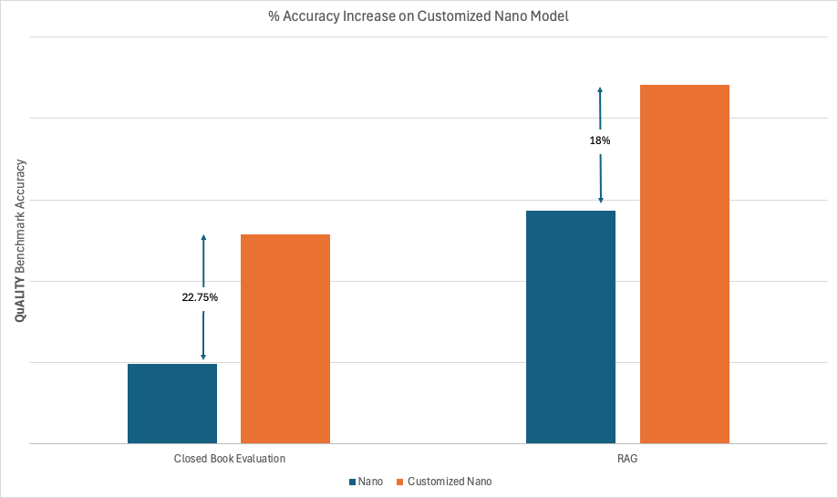

# Synthetic QA Generation for reasoning on your data

This notebook demonstrates how to use the `sdg` package to generate synthetic question-answer data with NEMOTRON Super as the teacher model. The generated data is designed to improve both the reading comprehension and reasoning abilities of a smaller student model, NEMOTRON NAMO, on a benchmark dataset of high-quality articles.

## Overview

The workflow includes:

- Defining an SDG pipeline using a YAML flow file
- Creating custom SDG blocks for handling output of thinking model
- Custom block for parsing the response into individual question-answer pairs
- Mixing synthetic QA data with instruction-tuned examples to form a training dataset
- Training a Nvidia Nemotron nano model on the the training dataset using our [training library](https://github.com/instructlab/training).

## Notebook Structure

### Creating ICLs
- SDG works by creating a set Question-Answer pairs from the source document.
- To do this we first need to create an example document and set of Question-Answer pairs. The SDG will use these to generate more synthetic QA pairs on top of all your document.
- For example, I have a news article. I want to train a model to be able to answer any question about that article. 
- I can craft example Question-Answer that show that:
  - Deal with specific facts in the article
  - Deal with broader theme of the aritcle
  - Reason on multiple parts of the article
- To acheive these my example QA also in this context known as ICLs will be of these types.
- The first section of the notebook will show you how I used Nemotron Super to generate these with chaining prompts.

### Generating Data and training
- In next few sections you will:
    - Learn how we added prompts for new teacher models
    - Generated data and did data mixing for training
    - And used our training library to train the nemotron nano model

### Results

Once the model is trained we evaluated it in a **closed-book setting** on [QuALITY Benchmark](https://github.com/nyu-mll/quality/tree/main), where the model answers questions based only on what it has learned during training, without access to the original articles.

We also evaluate the base model and customized nano model in a **RAG setting** where we use OpenAI embeddings and cohere re-ranker to retrieve relevant context from the article.

- Evaluation measures how well the model has **memorized and internalized** information from the articles
- Accuracy is compared between the base nano model and the Quality Customized nano model



*Plot showing percentage improvement in performance on the QuALITY Benchmark in Closed Book and RAG (Retrieval-Augmented Generation) settings after training*


### How does the model's response look?

#### Example 1
**Prompt:**
```text
#### Question
 Defining Decay Down by David Plotz how do dentists sell unnecessary cosmetic procedures to their patients?  There is only one correct choice.
#### Choices
A. All of the options are correct
B. By relying on psychological tricks and societal pressure
C. By using medical jargon to confuse the patient 
D. By implying that the procedures are more necessary than they really are
#### Thought Process and Answer
Thought process:
```
#### Model Response
```text
<think>
Okay, let's tackle this question. The question is about how dentists in the context of "Defining Decay Down" by David Plotz sell unnecessary cosmetic procedures. The options are A to D.
First, I need to recall what "Defining Decay Down" is about. From what I remember, the article discusses how dentists often use certain techniques to make patients feel pressured into getting treatments they don't strictly need. The title itself, "Defining Decay," suggests that dentists create a narrative of inevitable decay in the mouth, making patients think they need various procedures.
Looking at the options:
A. All of the options are correct. That seems unlikely because the question states there's only one correct choice. So probably not A.
B. Psychological tricks and societal pressure. This aligns with the idea of creating a sense of necessity. Dentists might use psychological manipulation, like making patients feel they need a certain procedure because of societal expectations or their own perceptions.
C. Using medical jargon to confuse. Hmm, medical jargon is standard in healthcare, but does it confuse patients? Maybe, but I think the article focuses more on psychological pressure than confusing through jargon. Not sure yet.
D. Implying procedures are more necessary than they are. This seems similar to B but more specific. The article might argue that dentists frame procedures as necessary, even if they're cosmetic. For example, claiming that a small crack is inevitable and only they can fix it properly.
Now, comparing B and D. The article's premise is that dentists create a sense of decay (necessity) through psychological means. So B says they use psychological tricks and societal pressure. D says they imply procedures are more necessary. Which one is more accurate?
In the article, Plotz describes how dentists use psychological tactics. For instance, they might say that a small imperfection is not just cosmetic but also a sign of aging or wear and tear that's inevitable. They might also use societal pressure, like the idea that everyone is getting their teeth done, so you should too. So B seems to cover both psychological and societal aspects.
But D is about implying necessity. If the procedures are cosmetic but presented as necessary, that's part of psychological manipulation. So maybe B and D are related. Wait, the options are separate. Let me check the exact answer from the article.
From what I recall, the key point is that dentists create a narrative of decay, making patients feel they need various treatments. They use psychological manipulation (B) and societal pressure (part of B). So B would be the correct answer. D is a subset of B perhaps. But the options are distinct. The answer is likely B. Alternatively, maybe D is a trick. Let me think again.
The question is about selling unnecessary procedures. Dentists might use psychological tricks (like making patients feel they have to fix things) and societal pressure (like peer pressure to have a certain appearance). So B combines both psychological and societal factors. D is more about the necessity aspect. The article's main argument is that dentists create a sense of decay (necessity) through psychological means and societal expectations. So B is the correct answer.
</think>

Thought process: The article "Defining Decay Down" highlights how dentists use psychological manipulation and societal pressure to frame cosmetic procedures as necessary, even when they are unnecessary. Dentists create a narrative of inevitable "decay" in the mouth, making patients feel pressured to undergo treatments they don't strictly require. While option D ("implying necessity") is partially true, the broader and more accurate answer encompasses both psychological tricks and societal pressure, as described in the article. 

Answer: B.
```

---

#### Example 2
**Prompt:**
```text
#### Question
 Defining Decay Down by David Plotz how would Stephen compare humans and machines? There is only one correct choice.
### Choices
A. He thinks they are similar enough that a conflict will arise
B. They are complementary in their abilities and can benefit from one another
C. They operate with similar systems of intelligence but to entirely different ends
D. Humans are at risk of losing access to knowledge if they let machines take over most tasks
```

#### Model Response
```text
<think>
Okay, let's tackle this question. The question is about how Stephen compares humans and machines in the context of the article "AI: what's the worst that could happen?" by Harry Armstrong in 2017. The options are A to D.
First, I need to recall the article. From what I remember, the article discusses the potential risks and benefits of AI. Stephen, who I think is a character or a person mentioned in the article, might have a specific viewpoint. The key here is to figure out his comparison between humans and machines.
Option A says they are similar enough that a conflict will arise. That sounds like a negative outcome where there's a conflict between the two. But Stephen's view might be more about their relationship than a conflict.
Option B suggests they are complementary and can benefit each other. This is a positive view, where they work together. But the article might be discussing risks, so maybe Stephen is more cautious.
Option C states they operate with similar intelligence systems but for different ends. This implies a structural similarity but different goals. The article might mention that AI systems are becoming too intelligent, leading to a loss of human agency.
Option D claims humans are at risk of losing knowledge if machines take over tasks. This is a common concern about AI replacing human work, leading to job losses and knowledge erosion.
Now, considering the article's context, Stephen's quote is crucial. If I recall correctly, Stephen (maybe a character from the article) says something like, "We're creating machines that are so intelligent that they're almost like us, but they don't have the same sense of morality or self-awareness." So he's suggesting that AI and humans operate with similar intelligence systems but for different purposes. That aligns with option C. 
Alternatively, option D is about losing knowledge, which is a consequence, but the question is about how Stephen compares them, not the consequence. The answer should be the direct comparison, not the outcome. So C seems right. Let me double-check. The article might have Stephen saying that AI is becoming too intelligent, leading to a loss of human control. So their intelligence systems are similar but with different ends. Yes, that's C.
</think>

Thought process: The article highlights Stephen's view that AI and humans operate with similar intelligence systems but serve different purposes. He argues that AI's rapid advancement could lead to a loss of human agency and control. This aligns with option C, which emphasizes structural similarity in intelligence but divergent goals. While option D addresses a consequence (knowledge loss), the question focuses on direct comparison, making C the best choice.

Answer: C.
```

## Key Takeaways

- Reasoning-capable LLMs can be used to create high-quality QA datasets to teach the model to for improving a model's reading comprehension and its ability to recall and reason on specific knowledge from source documents.
- How to use the `sdg` package to generate high-quality QA pairs from a source document, add new prompts, blocks and easy create pipeline variations.
- How to use our training library to train the model on the generated data.
